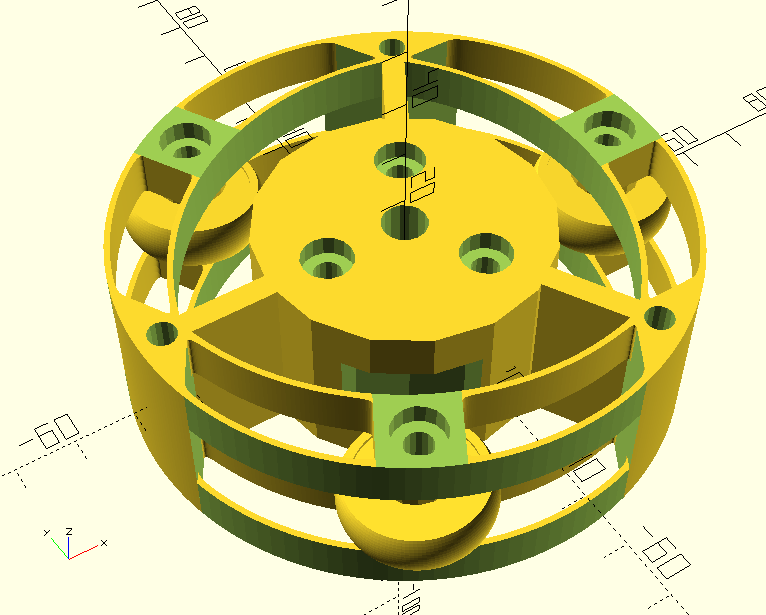
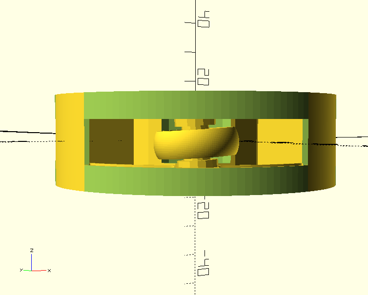

# pipecrawler
Crawler for helical scanning of pipes. Work in progress.

The idea is to build a robot that rotates inside the pipe and slowly moves along the pipe, on a helical track. Attaching a camera allows to image the pipe or to image whatever is outside a transparent pipe. Overlap of successive turns allows stitching the images or video together.

## First prototype 2023-04-21

First we try to build the upper unit that carries the camera. This should be rotated with respect to a lower unit.

This was 3d-printed in PETG in two halves ("top" and "bottom"). The flexure springs feel a bit too tight, likely demanding too much power from the motor.
