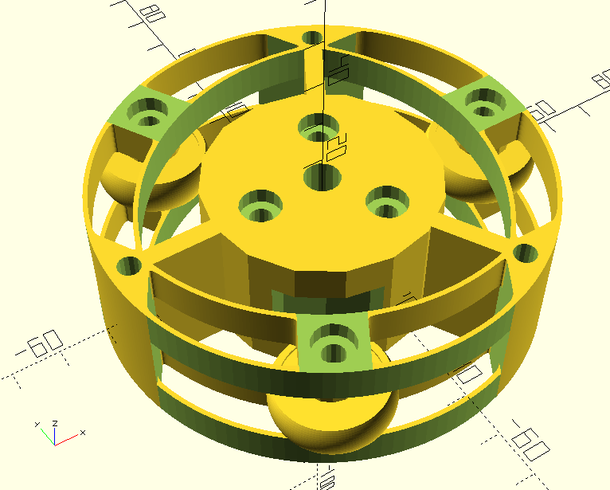

# Pipecrawler
Crawler for helical scanning of pipes. Work in progress.

The idea is to build a root imaging robot that travels and rotates inside a transparent pipe installed into the soil. The robot's camera will look at a helical track that overlaps itself by some amount on successive turns, so that the images or the video can be stitched together. Light sources can be attached to the robot. Attaching to the robot a phone with a camera may be the easiest option. A USB-C hub with external powering can be attached to the phone for charging and for peripherals such as a webcam for infrared imaging.

The initial design is for a pipe with an outer diameter of 120 mm and an inner diameter of 114 mm. PMMA is a good material for the pipe because it passes light wavelengths 400 nm to 1100 nm without significant attenuation. PMMA pipe with these dimensions is readily available at a cost around 50 €/m. A larger pipe with 150 mm outer diameter and a 144 mm inner diameter could alternatively be used, but it would be more expensive. Earth augers of both diameters are available for drilling the hole, with a cost around 250 € for the bit only.

A suitable budget phone costing around 200 € is [Samsung Galaxy A23 5G](https://www.gsmarena.com/samsung_galaxy_a23_5g-11736.php) with a 2 megapixel fixed-focus macro camera with a 30-50 mm (centered at 40 mm) focus distance and roughly a 60 degree horizontal field of view. If we would like to minimize motion blur in a 30 frames per second video to a width of 1 pixel in a 1600 horizontal pixels or 50 mm wide image, we'd need a horizontal scanning speed of 30 pixels per second, corresponding to 50 mm * (30 pixel / second) / (1500 pixel) = 1 mm / s. For a 120 mm pipe a single revolution is pi*120mm = 377 mm / revolution. We'd thus want a scanning speed of 377 mm / revolution / (1 mm / s) = 377 s / revolution or 6 minutes / revolution or 1 / (6 minutes / revolution) = 0.17 RPM. Sparkfun has a [0.5 RPM DC gear motor](https://www.sparkfun.com/products/12348) which is about as slow as they get, so that would be our choice if choosing a DC motor.

First we try to build the upper crawler unit that carries the camera. This should be rotated with respect to a lower crawler unit, by a slow motor.

## Prototype revision 1, 2023-04-21

The upper unit was 3d-printed in PETG in two halves ("top" and "bottom"). The flexure springs felt too tight, likely demanding too much power from a motor due to too much resistance.

## Prototype revision 2, 2023-05-08

The second revision of the prototype has a simpler and a less stiff spring arrangement. The bolt size was reduced from M4 to M3 and overhangs in bolt head slots were reduced to 45 degs because there were print problems with those.

The wheels use "608" roller blade bearings with a 3d-printed tire made of Fiberlogy Fiberflex 40D, a thermoplastic polyester filament. Unfortunately it is a bit slippery but perhaps not as slippery as thermoplastic polyurethane (TPU). Layer changes in printing give small bumps; vase mode printing could be investigated, but it would require g-code editing.

